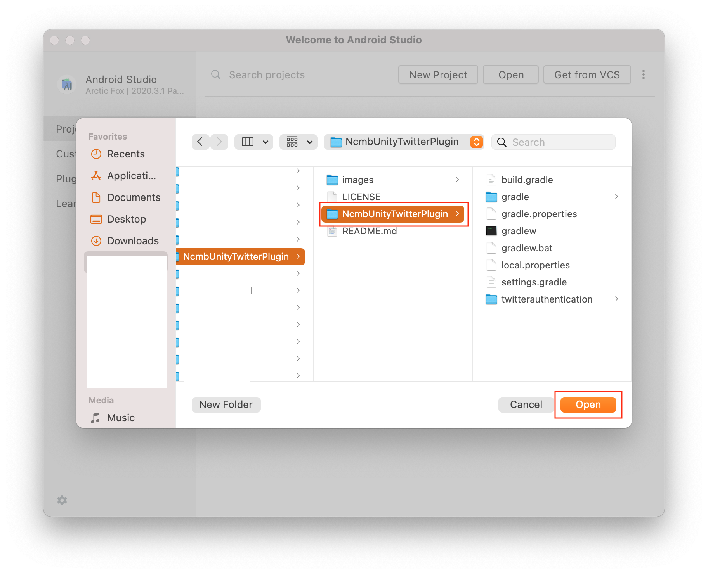
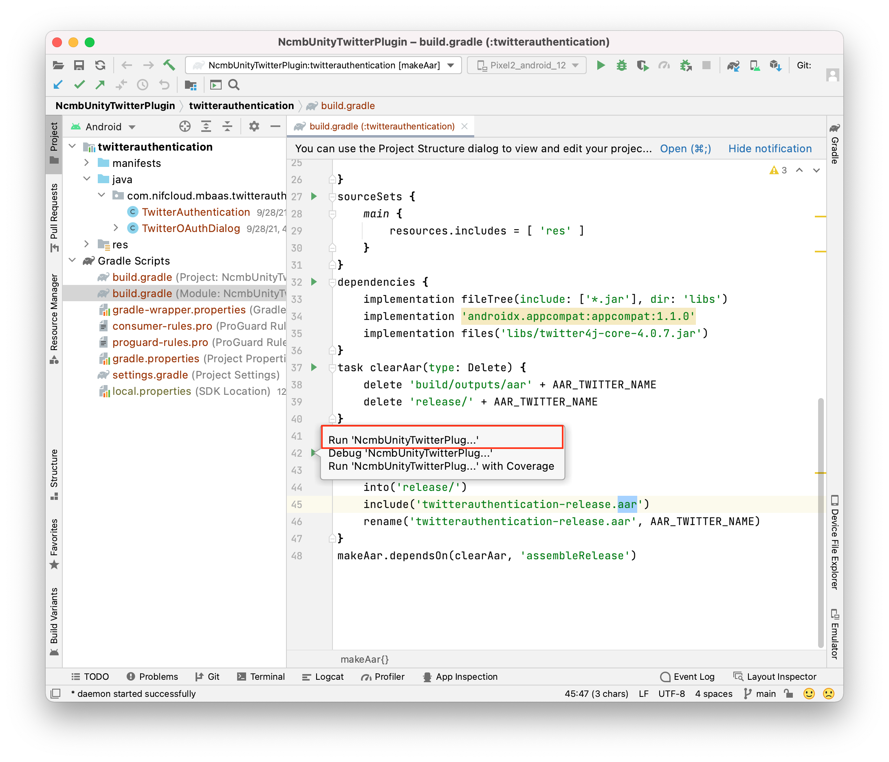
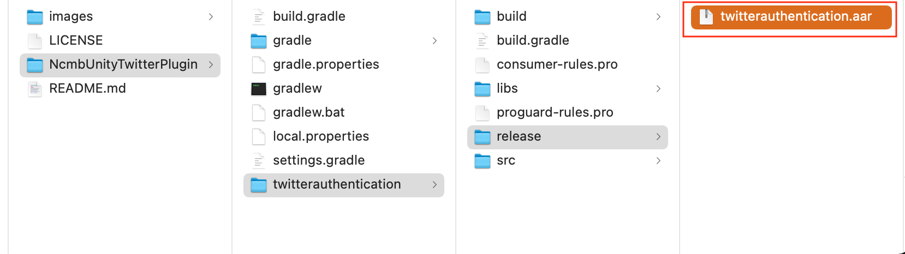

# NcmbUnityAndroidTwitterPlugin

## Overview
NcmbUnityTwitterPlugin is a plugin which support Unity's android signin with Twitter.
This plugin using [twitter4j](https://twitter4j.org/en/index.html) library to call Twitter's API.

## Installation

### Build AAR file:

1. Open this project in Android Studio.


2. Open file `NcmbUnityTwitterPlugin/twitterauthentication/build.gradle` at task `makeAar` Please Run it to build an `aar` file.


3. After build successfully, a file `twitterauthentication.aar` will be appeared at `NcmbUnityTwitterPlugin/NcmbUnityTwitterPlugin/twitterauthentication/release/twitterauthentication.aar`


## Usage

```C#
void Start()
{
    // sample SCHEME = myapp://
    NCMBOAuthTwitter.Init("TWITTER_KEY", "TWITTER_SECRET_KEY", "SCHEME");
}

// Update is called once per frame
void Update()
{

}
public void pressMe()
{
    INCMBTwitterCallback callback = new CallbackTwitter();
    NCMBOAuthTwitter.LogIn(callback);
    Debug.Log("Call login here....");
}

private class CallbackTwitter : INCMBTwitterCallback
{
    public void OnFailure(string errorMessage)
    {
        Debug.Log("errorMessage: " + errorMessage);
    }

    public void OnSuccess(string id, string userName, string token, string tokenSecret)
    {
        NCMBTwitterParameters parameters = new NCMBTwitterParameters(
            id.ToString(),
            userName,
            "TWITTER_KEY",
            "TWITTER_SECRET_KEY",
            token,
            tokenSecret
        );
        NCMBUser user = new NCMBUser();
        user.AuthData = parameters.param;
        //ニフクラ mobile backendにログイン
        user.LogInWithAuthDataAsync((NCMBException e) =>
        {
            Debug.Log("Login successfully!");
        });
        
    }
}

```

## License

The NcmbUnityTwitterPlugin is licensed under the Apache License 2.0. See the [LICENSE](LICENSE) file for more details.
